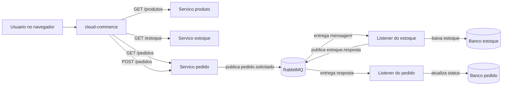
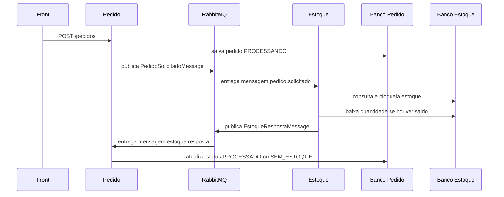

# Roteiro de apresentacao - Cloud Commerce

Este documento serve como roteiro para apresentar o projeto em video ou em uma explicacao ao vivo. A ideia e explicar o que foi feito, por que foi feito e como cada peca conversa com as outras.

## 1. Abertura

Fala sugerida:

```text
Este projeto e um estudo pratico de arquitetura de sistemas usando microservicos.
Eu criei uma aplicacao de e-commerce simples para estudar Spring Boot, separacao de responsabilidades, comunicacao HTTP, mensageria com RabbitMQ, containers com Docker e uma futura publicacao na AWS usando EC2 e ECR.
```

O projeto nao tenta ser um e-commerce completo. Ele usa um dominio pequeno para deixar visiveis os conceitos principais:

```text
produto
estoque
pedido
front
mensageria
containerizacao
deploy em nuvem
```

## 2. Objetivo do projeto

Fala sugerida:

```text
O objetivo foi construir um fluxo onde o usuario visualiza produtos, adiciona itens ao carrinho, cria um pedido e deixa o estoque responder de forma assincrona se o pedido pode ou nao ser processado.
```

O ponto de aprendizado esta no desenho:

```text
o front nao baixa estoque
o pedido nao conhece diretamente a regra interna do estoque
o estoque nao cria pedidos
o RabbitMQ coordena a troca de mensagens entre pedido e estoque
```

## 3. Componentes principais

### Front - cloud-commerce

Responsabilidade:

```text
Exibir as telas e permitir a interacao do usuario.
```

O front faz:

```text
GET /produtos no servico produto
GET /estoque no servico estoque
GET /pedidos no servico pedido
POST /pedidos ao finalizar o carrinho
```

O carrinho fica no `localStorage`. Isso foi proposital para permitir testar duas sessoes do navegador comprando o mesmo item.

Fala sugerida:

```text
Eu deixei o carrinho no localStorage para simular concorrencia. Assim posso abrir duas sessoes, colocar o mesmo produto no carrinho e tentar finalizar as compras. O objetivo e observar se o estoque consegue impedir que dois pedidos consumam a mesma unidade.
```

Arquivos importantes:

```text
cloud-commerce/src/main/resources/templates/estoque.html
cloud-commerce/src/main/resources/templates/carrinho.html
cloud-commerce/src/main/resources/templates/pedidos.html
cloud-commerce/src/main/resources/static/js/app.js
cloud-commerce/src/main/resources/static/js/estoque.js
cloud-commerce/src/main/resources/static/js/pedidos.js
```

### Servico produto

Responsabilidade:

```text
Guardar e expor o catalogo de produtos.
```

Endpoint principal:

```text
GET http://localhost:8082/produtos
```

Esse servico responde dados como:

```text
id
nome
descricao
preco
categoria
```

Fala sugerida:

```text
O servico de produto representa o catalogo. Ele nao sabe quanto existe em estoque e nao sabe se um pedido foi aprovado. Ele apenas responde quais produtos existem.
```

### Servico estoque

Responsabilidade:

```text
Guardar a quantidade disponivel por produto e processar pedidos solicitados.
```

Endpoint principal:

```text
GET http://localhost:8083/estoque
```

No fluxo RabbitMQ, o estoque tambem faz:

```text
consome PedidoSolicitadoMessage
verifica quantidade
baixa estoque se houver saldo
publica EstoqueRespostaMessage
```

Fala sugerida:

```text
O estoque e o dono da decisao sobre disponibilidade. Quando recebe uma mensagem de pedido solicitado, ele verifica todos os itens. Se todos tiverem quantidade suficiente, ele baixa o estoque. Se algum item nao tiver saldo, ele responde sem estoque.
```

Arquivos importantes:

```text
estoque/src/main/java/com/cloudcommerce/estoque/service/EstoquePedidoService.java
estoque/src/main/java/com/cloudcommerce/estoque/messaging/PedidoSolicitadoListener.java
estoque/src/main/java/com/cloudcommerce/estoque/messaging/EstoqueRespostaProducer.java
estoque/src/main/java/com/cloudcommerce/estoque/repository/EstoqueRepository.java
```

### Servico pedido

Responsabilidade:

```text
Criar pedidos, publicar pedido solicitado e atualizar o status quando o estoque responder.
```

Endpoint principal:

```text
GET  http://localhost:8084/pedidos
POST http://localhost:8084/pedidos
```

Quando o pedido e criado:

```text
status inicial: PROCESSANDO
```

Depois da resposta do estoque:

```text
PROCESSADO
SEM_ESTOQUE
```

Fala sugerida:

```text
O pedido nasce processando porque, neste momento, a aplicacao ainda nao sabe se existe estoque. A resposta vem depois por mensagem. Isso mostra um fluxo assincrono, onde a criacao do pedido e a confirmacao do estoque sao momentos diferentes.
```

Arquivos importantes:

```text
pedido/src/main/java/com/cloudcommerce/pedido/controller/PedidoController.java
pedido/src/main/java/com/cloudcommerce/pedido/service/PedidoService.java
pedido/src/main/java/com/cloudcommerce/pedido/service/ListnerService.java
pedido/src/main/java/com/cloudcommerce/pedido/messaging/PedidoSolicitadoProducer.java
pedido/src/main/java/com/cloudcommerce/pedido/messaging/EstoqueRespostaListener.java
```

## 4. Fluxo geral da aplicacao



Fala sugerida:

```text
Esse fluxograma mostra que o front usa HTTP para consultar e criar dados, mas a confirmacao do pedido passa por mensageria. O pedido publica um evento, o estoque processa e responde, e o pedido atualiza o status.
```

## 5. Por que usar HTTP e RabbitMQ juntos

HTTP foi usado para consultas diretas:

```text
listar produtos
listar estoque
listar pedidos
criar pedido
```

RabbitMQ foi usado para o fluxo que envolve processamento entre servicos:

```text
pedido solicitado
resposta do estoque
```

Fala sugerida:

```text
Nem tudo precisa ser mensagem. Para consulta simples, HTTP e direto e facil de visualizar. Para um processo entre servicos, como verificar estoque e atualizar status, a mensageria ajuda a reduzir acoplamento e permite que cada servico faca sua parte no seu tempo.
```

## 6. RabbitMQ explicado no contexto do projeto

### Exchange

No projeto:

```text
commerce.pedidos.exchange
```

A exchange recebe mensagens publicadas pelos servicos.

Fala sugerida:

```text
A exchange funciona como a entrada do RabbitMQ. O servico nao precisa conhecer diretamente a fila final. Ele publica na exchange usando uma routing key.
```

### Routing key

No projeto:

```text
pedido.solicitado
estoque.resposta
```

A routing key funciona como uma etiqueta da mensagem.

Fala sugerida:

```text
A routing key e uma etiqueta que diz o assunto da mensagem. Quando o pedido publica pedido.solicitado, o RabbitMQ usa os bindings para entregar na fila correta.
```

### Queue

No projeto:

```text
commerce.pedido.solicitado.queue
commerce.estoque.resposta.queue
```

A queue armazena mensagens ate um listener consumir.

Fala sugerida:

```text
A fila e a caixa de entrada. Se o consumidor estiver fora do ar, a mensagem fica esperando. Quando o consumidor volta, ele pode processar a mensagem.
```

### Binding

Ligacoes atuais:

```text
commerce.pedidos.exchange + pedido.solicitado -> commerce.pedido.solicitado.queue
commerce.pedidos.exchange + estoque.resposta  -> commerce.estoque.resposta.queue
```

Fala sugerida:

```text
O binding e a regra de roteamento. Ele diz ao RabbitMQ que mensagens com uma routing key especifica devem cair em uma fila especifica.
```

## 7. Fluxo de pedido em detalhes



Fala sugerida:

```text
O pedido nao e confirmado imediatamente. Primeiro ele e salvo como PROCESSANDO. Depois, o estoque responde. Essa resposta muda o status final do pedido.
```

## 8. Teste com duas sessoes

Objetivo:

```text
Simular duas compras concorrentes do mesmo produto.
```

Cenario:

```text
produtoId 1 com estoque 1
sessao A adiciona produtoId 1
sessao B adiciona produtoId 1
sessao A finaliza pedido
sessao B finaliza pedido
```

Resultado esperado:

```text
um pedido PROCESSADO
um pedido SEM_ESTOQUE
```

Fala sugerida:

```text
Esse teste mostra por que estoque precisa ser tratado no backend. Se a tela decidir sozinha, duas sessoes podem acreditar que existe estoque. A decisao real precisa acontecer no servico estoque.
```

## 9. O papel do lock pessimista

No repositorio de estoque existe:

```java
@Lock(LockModeType.PESSIMISTIC_WRITE)
```

Ideia:

```text
quando uma transacao esta verificando e baixando o estoque,
outra transacao precisa esperar
```

Fala sugerida:

```text
O lock pessimista ajuda a evitar que duas compras leiam o mesmo estoque ao mesmo tempo e ambas sejam aprovadas. Ele faz uma transacao esperar a outra terminar.
```

## 10. Erros encontrados e aprendizado

### Campo de estoque no front

Problema:

```text
o front procurava idProduto
o backend retornava produtoId
```

Aprendizado:

```text
contrato de API precisa estar alinhado entre front e backend
```

### CORS

Problema:

```text
o front em 8081 chamava servicos em 8082, 8083 e 8084
```

Solucao:

```text
adicionar @CrossOrigin(origins = "http://localhost:8081")
```

Aprendizado:

```text
mesmo em localhost, portas diferentes contam como origens diferentes para o navegador
```

### Constraint de status no banco

Problema:

```text
o Java tentou salvar PROCESSADO
o banco so aceitava PENDENTE, PROCESSANDO, PAGO, CONCLUIDO e ERRO
```

Aprendizado:

```text
o contrato entre aplicacao e banco tambem precisa estar alinhado
```

### Porta errada do RabbitMQ

Problema:

```text
abrir localhost:5672 no navegador
```

Correto:

```text
5672  -> comunicacao AMQP usada pelos servicos
15672 -> painel web do RabbitMQ
```

## 11. Como demonstrar na tela

### Passo 1 - RabbitMQ

Mostrar:

```text
docker compose ps
http://localhost:15672
```

Fala sugerida:

```text
Aqui o RabbitMQ esta rodando em container. A porta 5672 e usada pelos microservicos, e a porta 15672 abre o painel de administracao.
```

### Passo 2 - Servicos Spring Boot

Mostrar:

```text
produto 8082
estoque 8083
pedido 8084
front 8081
```

Fala sugerida:

```text
Cada servico roda em uma porta diferente para reforcar que eles sao aplicacoes separadas.
```

### Passo 3 - Tela de estoque

Mostrar:

```text
http://localhost:8081/estoque
```

Fala sugerida:

```text
Esta tela combina dados de dois microservicos. Os dados do produto vem do servico produto e a quantidade vem do servico estoque.
```

### Passo 4 - Carrinho

Mostrar:

```text
adicionar item
abrir carrinho
finalizar pedido
```

Fala sugerida:

```text
Ao finalizar, o front envia um POST para o servico pedido. O front nao chama o RabbitMQ diretamente.
```

### Passo 5 - Pedidos

Mostrar:

```text
http://localhost:8081/pedidos
```

Fala sugerida:

```text
Aqui eu consigo ver o resultado do processamento. O pedido nasce PROCESSANDO e depois recebe PROCESSADO ou SEM_ESTOQUE conforme a resposta do estoque.
```

### Passo 6 - RabbitMQ

Mostrar no painel:

```text
Queues and Streams
commerce.pedido.solicitado.queue
commerce.estoque.resposta.queue
```

Fala sugerida:

```text
As filas mostram se ha mensagens aguardando, em processamento ou consumidas. Durante um fluxo saudavel, as mensagens entram e saem rapidamente.
```

## 12. Comandos uteis de teste

Subir RabbitMQ:

```powershell
cd C:\Users\sirius.alves\Projetos\microservicoscommerce
docker compose up -d rabbitmq
docker compose ps
```

Ver filas pelo terminal:

```powershell
docker exec commerce-rabbitmq rabbitmqctl list_queues name messages_ready messages_unacknowledged messages consumers
```

Testar produto:

```powershell
Invoke-RestMethod "http://localhost:8082/produtos"
```

Testar estoque:

```powershell
Invoke-RestMethod "http://localhost:8083/estoque"
```

Criar pedido:

```powershell
$body = @{
  itens = @(
    @{
      produtoId = 1
      quantidade = 1
      precoUnitario = 99.90
    }
  )
} | ConvertTo-Json -Depth 5

Invoke-RestMethod `
  -Uri "http://localhost:8084/pedidos" `
  -Method Post `
  -ContentType "application/json" `
  -Body $body
```

Listar pedidos:

```powershell
Invoke-RestMethod "http://localhost:8084/pedidos"
```

## 13. Proximos passos tecnicos

Proximas evolucoes naturais:

```text
criar Docker Compose completo para todos os servicos
remover credenciais do application.properties
usar variaveis de ambiente
publicar imagens no Amazon ECR
rodar containers na EC2
adicionar API Gateway ou Load Balancer
evoluir para ECS ou Kubernetes
adicionar observabilidade com logs e metricas
```

Fala de fechamento:

```text
Com esse projeto eu consegui estudar o ciclo completo de uma arquitetura distribuida em pequena escala: front, microservicos, banco, mensageria, containers e preparacao para cloud.
```
