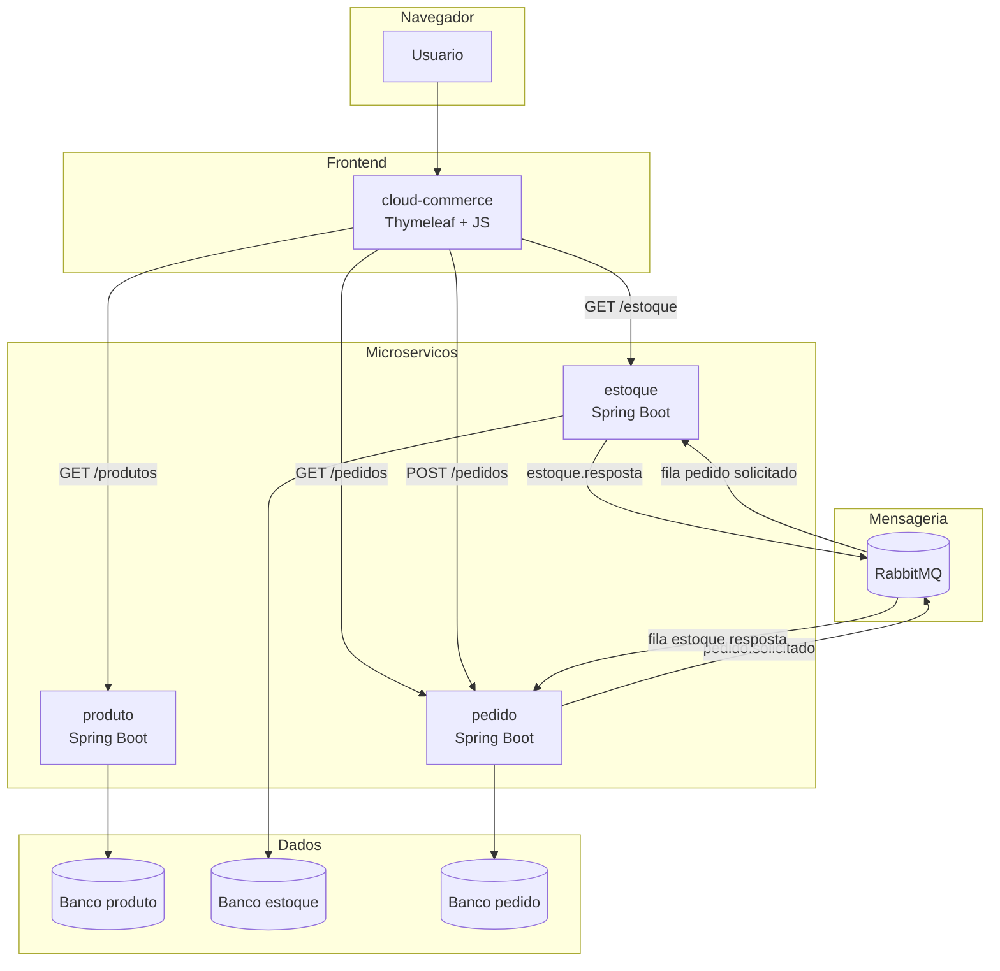
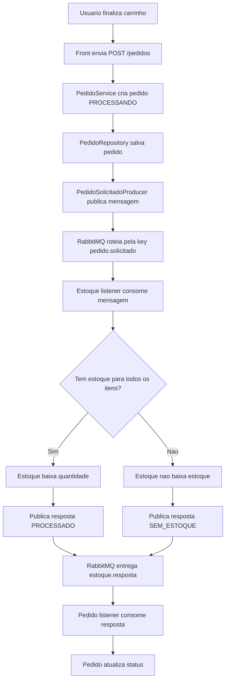
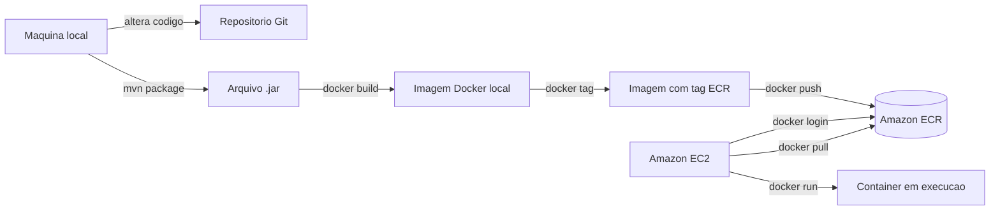
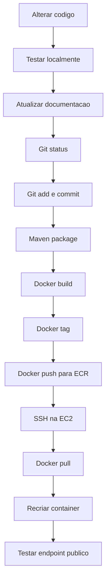

# Implantacao progressiva de um e-commerce em microservicos com RabbitMQ, Docker, Amazon ECR e EC2

## Resumo

Este trabalho apresenta a construcao incremental de uma aplicacao de e-commerce baseada em microservicos. O projeto foi desenvolvido com Java Spring Boot, front em Thymeleaf/JavaScript, comunicacao HTTP entre front e APIs, processamento assincrono com RabbitMQ e preparacao para containerizacao com Docker. A etapa atual validou o fluxo funcional entre os servicos `produto`, `estoque` e `pedido`, incluindo criacao de pedido, verificacao de estoque por mensagem e atualizacao de status. A proxima etapa do estudo concentra-se na publicacao de imagens Docker no Amazon Elastic Container Registry (ECR) e execucao em uma instancia Amazon EC2.

Palavras-chave:

```text
microservicos
RabbitMQ
Docker
Amazon EC2
Amazon ECR
Spring Boot
mensageria
```

## 1. Introducao

Aplicacoes modernas frequentemente precisam ser escalaveis, resilientes e faceis de evoluir. Uma forma de estudar esse tipo de arquitetura e decompor uma aplicacao simples em servicos independentes.

Neste projeto, o dominio escolhido foi um e-commerce pequeno. A escolha permite demonstrar problemas comuns em sistemas distribuidos:

```text
consulta de catalogo
consulta de estoque
criacao de pedido
concorrencia na baixa de estoque
processamento assincrono
atualizacao de status
deploy em containers
```

O projeto tambem serve como base para estudar AWS. A meta final e criar um ciclo de desenvolvimento e publicacao:

```text
alterar aplicacao
buildar localmente
comitar no Git
gerar imagem Docker
enviar imagem ao Amazon ECR
atualizar container na EC2
```

## 2. Objetivos

### Objetivo geral

Construir uma aplicacao de e-commerce em microservicos para estudar arquitetura distribuida, mensageria, Docker e publicacao em ambiente AWS.

### Objetivos especificos

```text
separar responsabilidades entre produto, estoque e pedido
usar HTTP para consultas e criacao inicial de pedido
usar RabbitMQ para comunicacao assincrona entre pedido e estoque
containerizar cada servico com Docker
publicar imagens no Amazon ECR
executar a aplicacao em uma instancia EC2
documentar os aprendizados e erros encontrados
```

## 3. Estado atual da arquitetura

Servicos existentes:

```text
cloud-commerce -> front web
produto        -> catalogo
estoque        -> disponibilidade e baixa de estoque
pedido         -> criacao e status de pedidos
rabbitmq       -> broker de mensagens
```

Portas locais:

```text
8081 -> cloud-commerce
8082 -> produto
8083 -> estoque
8084 -> pedido
5672 -> RabbitMQ AMQP
15672 -> RabbitMQ Management UI
```

## 4. Diagrama de componentes



## 5. Fluxo funcional do pedido



## 6. Contratos de mensagem

### PedidoSolicitadoMessage

Mensagem publicada pelo servico `pedido`:

```json
{
  "pedidoId": 1,
  "valorTotal": 99.90,
  "solicitadoEm": "2026-08-25T16:01:33",
  "itens": [
    {
      "produtoId": 1,
      "quantidade": 1
    }
  ]
}
```

### EstoqueRespostaMessage

Mensagem publicada pelo servico `estoque`:

```json
{
  "pedidoId": 1,
  "estoqueDisponivel": true,
  "status": "PROCESSADO",
  "motivo": "Estoque baixado com sucesso.",
  "respondidoEm": "2026-08-25T16:02:00"
}
```

## 7. RabbitMQ

Exchange:

```text
commerce.pedidos.exchange
```

Filas:

```text
commerce.pedido.solicitado.queue
commerce.estoque.resposta.queue
```

Bindings:

```text
commerce.pedidos.exchange + pedido.solicitado -> commerce.pedido.solicitado.queue
commerce.pedidos.exchange + estoque.resposta  -> commerce.estoque.resposta.queue
```

## 8. Erros e aprendizados encontrados

### 8.1 Erro de contrato entre front e backend

O front procurava `idProduto`, mas o backend retornava `produtoId`.

Aprendizado:

```text
contratos entre sistemas precisam ser explicitos e consistentes
```

### 8.2 CORS

Como o front roda em `8081` e os servicos rodam em outras portas, o navegador bloqueia chamadas se os backends nao permitirem a origem.

Solucao aplicada:

```java
@CrossOrigin(origins = "http://localhost:8081")
```

### 8.3 Constraint de status

O banco recusou `PROCESSADO` porque a constraint `chk_pedido_status` nao permitia esse valor.

Aprendizado:

```text
o dominio da aplicacao e o schema do banco precisam evoluir juntos
```

### 8.4 Porta do RabbitMQ

Portas:

```text
5672  -> protocolo AMQP, usado pela aplicacao
15672 -> painel web do RabbitMQ
```

## 9. Containerizacao com Docker

Cada servico possui um `Dockerfile`.

Modelo atual:

```dockerfile
FROM eclipse-temurin:21-jre

WORKDIR /app

COPY target/nome-do-servico-0.0.1-SNAPSHOT.jar app.jar

EXPOSE 808X

ENTRYPOINT ["java", "-jar", "app.jar"]
```

Esse modelo usa uma imagem com Java 21 Runtime e copia o `.jar` ja gerado pelo Maven.

Consequencia:

```text
antes de docker build, e necessario rodar mvn package
```

Exemplo:

```powershell
cd C:\Users\sirius.alves\Projetos\microservicoscommerce\pedido
.\mvnw.cmd clean package -DskipTests
docker build -t cloud-commerce-pedido:local .
```

## 10. Docker Compose local

O projeto possui `docker-compose.yml` para subir o RabbitMQ:

```powershell
cd C:\Users\sirius.alves\Projetos\microservicoscommerce
docker compose up -d rabbitmq
docker compose ps
```

Painel:

```text
http://localhost:15672
usuario: guest
senha: guest
```

Comandos de diagnostico:

```powershell
docker exec commerce-rabbitmq rabbitmqctl list_queues name messages_ready messages_unacknowledged messages consumers
docker exec commerce-rabbitmq rabbitmqctl list_exchanges name type durable
docker exec commerce-rabbitmq rabbitmqctl list_bindings source_name source_kind destination_name destination_kind routing_key
```

## 11. Preparacao do Windows para Docker Desktop

Durante o estudo, o Docker Desktop precisou de virtualizacao.

Comandos executados no PowerShell como Administrador:

```powershell
dism.exe /online /enable-feature /featurename:Microsoft-Windows-Subsystem-Linux /all /norestart
dism.exe /online /enable-feature /featurename:VirtualMachinePlatform /all /norestart
dism.exe /online /enable-feature /featurename:Microsoft-Hyper-V /all /norestart

bcdedit /set hypervisorlaunchtype auto

wsl --update

shutdown /r /t 0
```

Se a virtualizacao ainda estivesse desabilitada no firmware, o caminho seria reiniciar na BIOS/UEFI:

```powershell
shutdown /r /fw /t 0
```

E habilitar um item como:

```text
Intel Virtualization Technology
Intel VT-x
VT-d
AMD SVM
SVM Mode
AMD-V
IOMMU
```

Verificacao:

```powershell
systeminfo
```

Procurar:

```text
Virtualization Enabled In Firmware: Yes
```

## 12. Estado atual da AWS

Etapas ja realizadas:

```text
conta AWS criada
instancia EC2 criada com 20 GB
Docker instalado na EC2
Amazon ECR criado
policy de acesso ao ECR associada na EC2
```

Observacao importante:

```text
O Amazon ECR nao builda a imagem sozinho.
Ele e um registry, ou seja, armazena imagens Docker.
```

O build precisa acontecer em algum lugar:

```text
maquina local
EC2
pipeline CI/CD
AWS CodeBuild
```

Neste estudo, o fluxo inicial sera:

```text
build local -> docker push ECR -> docker pull EC2 -> docker run EC2
```

## 13. Diagrama de publicacao com ECR e EC2



## 14. Variaveis usadas nos comandos AWS

Preencha antes de rodar:

```powershell
$AWS_REGION = "sa-east-1"
$AWS_ACCOUNT_ID = "<id-da-sua-conta-aws>"
$ECR_URI = "$AWS_ACCOUNT_ID.dkr.ecr.$AWS_REGION.amazonaws.com"
```

Exemplo de repositorios:

```powershell
$REPO_FRONT = "cloud-commerce-front"
$REPO_PRODUTO = "cloud-commerce-produto"
$REPO_ESTOQUE = "cloud-commerce-estoque"
$REPO_PEDIDO = "cloud-commerce-pedido"
$IMAGE_TAG = "v1"
```

## 15. Criacao de repositorios ECR

Se ainda nao existirem:

```powershell
aws ecr create-repository --repository-name $REPO_FRONT --region $AWS_REGION
aws ecr create-repository --repository-name $REPO_PRODUTO --region $AWS_REGION
aws ecr create-repository --repository-name $REPO_ESTOQUE --region $AWS_REGION
aws ecr create-repository --repository-name $REPO_PEDIDO --region $AWS_REGION
```

## 16. Login no ECR

```powershell
aws ecr get-login-password --region $AWS_REGION |
  docker login --username AWS --password-stdin $ECR_URI
```

Esse login gera uma autenticacao temporaria para o Docker enviar ou baixar imagens do ECR.

## 17. Build local dos JARs

Rodar a partir de cada modulo:

```powershell
cd C:\Users\sirius.alves\Projetos\microservicoscommerce\cloud-commerce
.\mvnw.cmd clean package -DskipTests

cd C:\Users\sirius.alves\Projetos\microservicoscommerce\produto
.\mvnw.cmd clean package -DskipTests

cd C:\Users\sirius.alves\Projetos\microservicoscommerce\estoque
.\mvnw.cmd clean package -DskipTests

cd C:\Users\sirius.alves\Projetos\microservicoscommerce\pedido
.\mvnw.cmd clean package -DskipTests
```

## 18. Build, tag e push de imagens para ECR

### Front

```powershell
cd C:\Users\sirius.alves\Projetos\microservicoscommerce\cloud-commerce
docker build -t "${REPO_FRONT}:${IMAGE_TAG}" .
docker tag "${REPO_FRONT}:${IMAGE_TAG}" "${ECR_URI}/${REPO_FRONT}:${IMAGE_TAG}"
docker push "${ECR_URI}/${REPO_FRONT}:${IMAGE_TAG}"
```

### Produto

```powershell
cd C:\Users\sirius.alves\Projetos\microservicoscommerce\produto
docker build -t "${REPO_PRODUTO}:${IMAGE_TAG}" .
docker tag "${REPO_PRODUTO}:${IMAGE_TAG}" "${ECR_URI}/${REPO_PRODUTO}:${IMAGE_TAG}"
docker push "${ECR_URI}/${REPO_PRODUTO}:${IMAGE_TAG}"
```

### Estoque

```powershell
cd C:\Users\sirius.alves\Projetos\microservicoscommerce\estoque
docker build -t "${REPO_ESTOQUE}:${IMAGE_TAG}" .
docker tag "${REPO_ESTOQUE}:${IMAGE_TAG}" "${ECR_URI}/${REPO_ESTOQUE}:${IMAGE_TAG}"
docker push "${ECR_URI}/${REPO_ESTOQUE}:${IMAGE_TAG}"
```

### Pedido

```powershell
cd C:\Users\sirius.alves\Projetos\microservicoscommerce\pedido
docker build -t "${REPO_PEDIDO}:${IMAGE_TAG}" .
docker tag "${REPO_PEDIDO}:${IMAGE_TAG}" "${ECR_URI}/${REPO_PEDIDO}:${IMAGE_TAG}"
docker push "${ECR_URI}/${REPO_PEDIDO}:${IMAGE_TAG}"
```

## 19. Instalacao de Docker na EC2 Amazon Linux 2023

Comandos de referencia:

```bash
sudo yum update -y
sudo yum install -y docker
sudo service docker start
sudo usermod -a -G docker ec2-user
```

Depois, sair do SSH e entrar novamente.

Validar:

```bash
docker info
```

## 20. Pull e execucao na EC2

Na EC2:

```bash
AWS_REGION="sa-east-1"
AWS_ACCOUNT_ID="<id-da-sua-conta-aws>"
ECR_URI="$AWS_ACCOUNT_ID.dkr.ecr.$AWS_REGION.amazonaws.com"
IMAGE_TAG="v1"
```

Login no ECR:

```bash
aws ecr get-login-password --region "$AWS_REGION" |
  docker login --username AWS --password-stdin "$ECR_URI"
```

Criar rede Docker:

```bash
docker network create commerce-net
```

Subir RabbitMQ na EC2:

```bash
docker run -d \
  --name commerce-rabbitmq \
  --network commerce-net \
  --restart unless-stopped \
  -p 5672:5672 \
  -p 15672:15672 \
  -e RABBITMQ_DEFAULT_USER=guest \
  -e RABBITMQ_DEFAULT_PASS=guest \
  rabbitmq:3.13-management
```

Baixar imagens:

```bash
docker pull "$ECR_URI/cloud-commerce-produto:$IMAGE_TAG"
docker pull "$ECR_URI/cloud-commerce-estoque:$IMAGE_TAG"
docker pull "$ECR_URI/cloud-commerce-pedido:$IMAGE_TAG"
docker pull "$ECR_URI/cloud-commerce-front:$IMAGE_TAG"
```

Executar produto:

```bash
docker run -d \
  --name produto \
  --network commerce-net \
  --restart unless-stopped \
  -p 8082:8082 \
  "$ECR_URI/cloud-commerce-produto:$IMAGE_TAG"
```

Executar estoque:

```bash
docker run -d \
  --name estoque \
  --network commerce-net \
  --restart unless-stopped \
  -p 8083:8083 \
  -e RABBITMQ_HOST=commerce-rabbitmq \
  -e RABBITMQ_PORT=5672 \
  -e RABBITMQ_USERNAME=guest \
  -e RABBITMQ_PASSWORD=guest \
  "$ECR_URI/cloud-commerce-estoque:$IMAGE_TAG"
```

Executar pedido:

```bash
docker run -d \
  --name pedido \
  --network commerce-net \
  --restart unless-stopped \
  -p 8084:8084 \
  -e RABBITMQ_HOST=commerce-rabbitmq \
  -e RABBITMQ_PORT=5672 \
  -e RABBITMQ_USERNAME=guest \
  -e RABBITMQ_PASSWORD=guest \
  "$ECR_URI/cloud-commerce-pedido:$IMAGE_TAG"
```

Executar front:

```bash
docker run -d \
  --name cloud-commerce \
  --network commerce-net \
  --restart unless-stopped \
  -p 8081:8081 \
  "$ECR_URI/cloud-commerce-front:$IMAGE_TAG"
```

## 21. Atualizacao de imagem na EC2

Quando uma imagem nova for enviada para o ECR:

```bash
AWS_REGION="sa-east-1"
AWS_ACCOUNT_ID="<id-da-sua-conta-aws>"
ECR_URI="$AWS_ACCOUNT_ID.dkr.ecr.$AWS_REGION.amazonaws.com"
IMAGE_TAG="v2"
SERVICE_NAME="pedido"
REPOSITORY_NAME="cloud-commerce-pedido"
PORT="8084"
```

Login:

```bash
aws ecr get-login-password --region "$AWS_REGION" |
  docker login --username AWS --password-stdin "$ECR_URI"
```

Atualizar container:

```bash
docker pull "$ECR_URI/$REPOSITORY_NAME:$IMAGE_TAG"
docker stop "$SERVICE_NAME"
docker rm "$SERVICE_NAME"

docker run -d \
  --name "$SERVICE_NAME" \
  --network commerce-net \
  --restart unless-stopped \
  -p "$PORT:$PORT" \
  -e RABBITMQ_HOST=commerce-rabbitmq \
  -e RABBITMQ_PORT=5672 \
  -e RABBITMQ_USERNAME=guest \
  -e RABBITMQ_PASSWORD=guest \
  "$ECR_URI/$REPOSITORY_NAME:$IMAGE_TAG"
```

## 22. Ciclo de trabalho recomendado



Comandos Git:

```powershell
git status
git add .
git commit -m "Implementa fluxo de pedidos com RabbitMQ"
```

## 23. Cuidados de seguranca

Pontos a melhorar antes de expor em ambiente publico:

```text
nao deixar senhas no application.properties
usar variaveis de ambiente ou AWS Secrets Manager
nao expor a porta 15672 do RabbitMQ publicamente
restringir Security Group da EC2
usar IAM com minimo privilegio
usar tags de imagem versionadas em vez de apenas latest
configurar logs e metricas
```

Para EC2 que apenas baixa imagens do ECR, uma policy de pull/read costuma ser suficiente. Para usuario ou processo que envia imagens ao ECR, e necessario permissao de push.

## 24. Proximas etapas

```text
criar Docker Compose completo com todos os servicos
ajustar front para usar URLs configuraveis por ambiente
subir primeira imagem de um servico no ECR
rodar esse servico na EC2
automatizar update com script
avaliar uso de ECS como proximo passo antes de Kubernetes
estudar Load Balancer ou API Gateway
adicionar CloudWatch para logs
```

## 25. Referencias oficiais

- Amazon ECR - Push de imagem Docker: https://docs.aws.amazon.com/AmazonECR/latest/userguide/docker-push-ecr-image.html
- AWS CLI - `ecr get-login-password`: https://docs.aws.amazon.com/cli/latest/reference/ecr/get-login-password.html
- Amazon ECR - repositorios privados e ciclo de imagem: https://docs.aws.amazon.com/AmazonECR/latest/userguide/image-push.html
- Amazon ECR - politicas gerenciadas: https://docs.aws.amazon.com/AmazonECR/latest/userguide/security-iam-awsmanpol.html
- Amazon ECS/Amazon Linux 2023 - instalacao de Docker em EC2: https://docs.aws.amazon.com/AmazonECS/latest/developerguide/create-container-image.html
